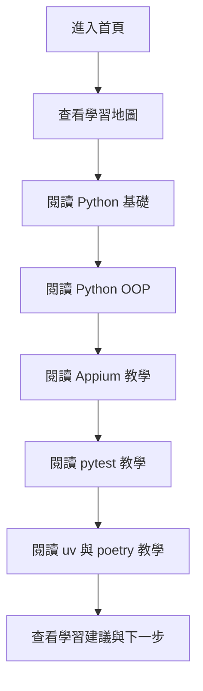

## 1. 產品概述
這是一個以 `Python`、`Appium`、`pytest`、`uv` 與 `poetry` 為核心的單頁教學網站，提供從語法基礎到自動化測試與套件管理的完整入門路徑。
- 目標是幫助初學者以清楚的章節式內容快速建立 Python 與測試自動化的整體認知。
- 產品價值在於將零散知識整理為一頁式學習地圖，降低新手切換主題時的理解成本。

## 2. 核心功能

### 2.1 功能模組
1. **首頁**：品牌標題、導覽列、學習路線概覽、主題章節導覽。
2. **Python 基礎教學區**：基本語法、資料類型、流程控制、範例程式碼。
3. **Python OOP 教學區**：深入說明 class、object、attribute、instance method、class method、static method、`__init__`、封裝與繼承，並搭配清楚範例。
4. **Appium 教學區**：Appium 角色、測試流程、跨 Android/iOS locator 策略、wait、座標點擊與除錯技巧。
5. **pytest 教學區**：測試結構、fixture、assert、執行方式與範例。
6. **套件管理教學區**：`uv`、`poetry` 的用途、初始化、安裝與虛擬環境操作。
7. **學習建議區**：推薦學習順序、工具搭配方式、常見新手問題提示。

### 2.2 頁面詳情
| 頁面名稱 | 模組名稱 | 功能描述 |
|-----------|-------------|---------------------|
| 首頁 | Hero 區塊 | 顯示網站標題、副標題、學習主軸與快速進入按鈕 |
| 首頁 | 導覽列 | 提供章節錨點跳轉，快速定位到指定教學主題 |
| 首頁 | 學習地圖 | 以流程式卡片展示 Python -> OOP -> Appium -> pytest -> 套件管理 的學習順序 |
| 首頁 | Python 基礎 | 說明變數、輸入輸出、字串、數字、串列、字典與流程控制 |
| 首頁 | Python OOP | 深入說明 class、object、attribute、instance/class/static method、`__init__`、封裝與繼承 |
| 首頁 | Appium | 介紹跨 Android/iOS locator 寫法、等待策略、座標點擊與點擊失敗時的替代方案 |
| 首頁 | pytest | 介紹測試檔命名、測試函式、fixture、斷言與執行命令 |
| 首頁 | 套件管理 | 對比 `uv` 與 `poetry` 的使用情境與常見指令 |
| 首頁 | 學習建議 | 提供初學者推薦順序、實務搭配方式與下一步方向 |

## 3. 核心流程
使用者進入網站後，先從學習地圖了解整體路線，再依序閱讀 Python 基礎、OOP、Appium、pytest 與套件管理章節。網站會特別加強 Python OOP 的觀念拆解，並在 Appium 區提供 Android/iOS 共用 locator、wait 與座標點擊等實戰技巧。每個章節都提供簡短說明、重點整理與程式碼範例，最後由學習建議區協助使用者安排下一步實作。

## 4. 使用者介面設計
### 4.1 設計風格
- 主色：深藍黑、靛藍、青綠光感色，建立技術教學與終端機氛圍
- 輔色：暖黃與亮青色，用於標題強調、按鈕與關鍵字標示
- 按鈕風格：圓角膠囊按鈕，搭配發光邊框與 hover 位移效果
- 字體：標題使用具技術感的展示字體，內文使用清楚易讀的閱讀字體
- 版面風格：桌面優先的單頁捲動式教學網站，混合大標題、卡片、程式碼區塊與時間軸式學習路徑
- 圖示風格：簡潔線性圖示與程式語言關鍵字標籤，不依賴插圖也能保有視覺層次

### 4.2 頁面設計概覽
| 頁面名稱 | 模組名稱 | UI 元素 |
|-----------|-------------|-------------|
| 首頁 | Hero 區塊 | 漸層背景、主標題、副標、兩個 CTA、浮動資訊卡 |
| 首頁 | 導覽列 | 固定頂部導覽、章節連結、目前閱讀區塊高亮 |
| 首頁 | 學習地圖 | 橫向或縱向節點卡片、步驟編號、學習重點摘要 |
| 首頁 | 教學章節 | 每節含標題、重點清單、語法說明、程式碼示例卡片 |
| 首頁 | OOP 深入區 | 以多張卡片拆分觀念，包含類別定義、屬性、方法型別與繼承範例 |
| 首頁 | Appium 實戰區 | 以實務片段呈現跨平台 locator、座標點擊與 wait 範例 |
| 首頁 | 套件管理比較 | 雙欄比較卡、指令列表、適用情境標籤 |
| 首頁 | 學習建議 | FAQ 式提示區、推薦實作順序、結尾 CTA |

### 4.3 響應式設計
- 採桌面優先設計，兼顧平板與手機自適應排版
- 手機版將多欄卡片改為單欄堆疊，保留錨點導覽與良好閱讀間距
- 程式碼區塊需支援橫向捲動，避免在小螢幕破版
- 導覽列在窄螢幕改為可換行或簡化排列，確保章節連結仍可操作
