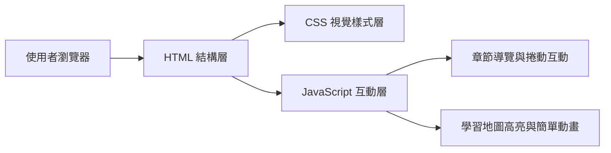

## 1. 架構設計
本專案採用純前端靜態網站架構，不依賴後端服務。頁面以單一 `HTML` 檔為主體，搭配 `CSS` 控制視覺樣式、`JavaScript` 處理導覽互動與小型動態效果，部署與開啟方式簡單，適合作為教學展示頁。

## 2. 技術說明
- 前端：`HTML5` + `CSS3` + `Vanilla JavaScript`
- 初始化方式：直接建立靜態檔案，無需建置工具
- 後端：無
- 資料來源：頁面內建靜態教學內容與程式碼範例
- 部署方式：可直接以瀏覽器開啟 `index.html`，或放置於任意靜態網站主機

## 3. 路由定義
| 路由 | 用途 |
|-------|---------|
| `/` | 顯示整個 Python、Appium、pytest 與套件管理教學單頁 |

## 4. 模組切分
| 模組名稱 | 職責 |
|-----------|------|
| `index.html` | 定義頁面語意結構、章節內容、程式碼區塊與導覽錨點 |
| `style.css` | 管理整體配色、排版、卡片、程式碼區塊、響應式設計與動畫 |
| `script.js` | 處理導覽平滑捲動、目前章節高亮、按鈕互動與輕量視覺效果 |

## 5. 頁面區塊規劃
| 區塊 | 內容 | 實作重點 |
|------|------|----------|
| Hero | 網站名稱、主描述、快速入口 | 強烈視覺識別、清楚價值主張 |
| 學習地圖 | 五大主題學習順序 | 以卡片或時間軸形式呈現知識路徑 |
| Python 基礎 | 基本語法、資料類型、流程控制 | 重點清單與簡短範例並排 |
| Python OOP | class、object、attribute、method、建構子、繼承 | 以多段範例與概念拆分幫助初學者理解 |
| Appium | 自動化概念、跨平台 locator、wait、座標點擊 | 以實戰情境呈現 Android/iOS 共用寫法與除錯手法 |
| pytest | 測試撰寫方式、fixture、assert | 提供可直接理解的測試案例 |
| uv / poetry | 工具差異、初始化、安裝指令 | 採比較表與指令區塊提升可讀性 |
| Footer | 總結與下一步 | 引導使用者持續學習與練習 |

## 6. 互動與體驗設計
- 頂部導覽列支援錨點跳轉與平滑捲動
- 當使用者捲動時，自動高亮目前所在章節
- 重要教學卡片提供 hover 動態與陰影層次
- 程式碼區塊提供清楚字距、語法色彩傾向與可讀背景
- 章節之間使用節奏明確的留白與背景層次，避免長頁面閱讀疲勞
- OOP 與 Appium 重點區需使用更高資訊密度的卡片與程式碼區塊，強化教學深度

## 7. 響應式策略
- 桌面版採雙欄與多欄卡片編排，突顯學習地圖與比較資訊
- 平板版保留卡片網格，但縮減欄數與字級層次
- 手機版改為單欄堆疊，保留閱讀順序與可點擊性
- 所有按鈕與導覽項目需具備足夠點擊區域

## 8. 可維護性原則
- 將每個教學主題獨立為可辨識的 section，便於日後擴充新章節
- 使用 CSS 變數管理色彩、陰影與間距，提高一致性
- JavaScript 僅處理必要互動，避免過度複雜化
- 範例內容盡量模組化排版，後續可快速替換成更進階教材
- Appium 範例需包含 Android/iOS locator 對照、顯式等待與座標點擊示例區塊
